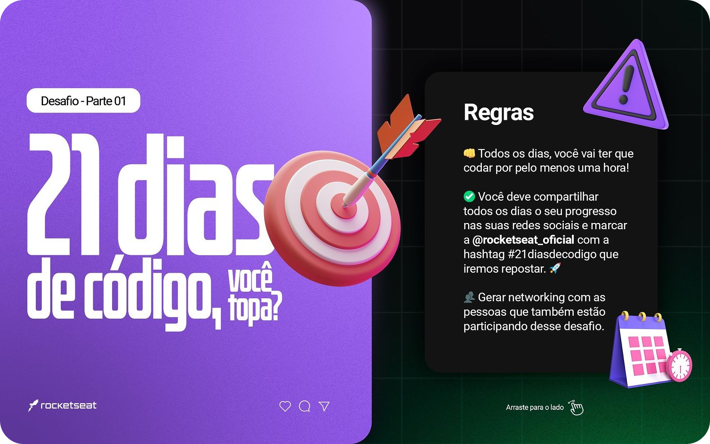

# E aí, bora pro Desafio? 🔥  

💡 Ter um prazo para realizar tarefas, contribui para a saúde mental de quem deseja criar um hábito.

Não se esqueça! Utilize as hastags a baixo em suas postagens, publique no stories e feed e cumpra os desafios todos os dias!
  
> @rocketseat @jakeliny.gracielly #21diasdecodigo #soumarmiteiro

>  #100daysofcode #rocketseat #desenvolvedor #html #dev #challenge #css #habito

 - [x] Dia 01: Crie um repositório para listar os projetos que serão desenvolvidos durante os 21 dias de código;
 - [x] Dia 02: Faça um Hello World customizado com fontes, cores e imagens;
 - [x] Dia 03: Crie um botão animado;
 - [x] Dia 04: Crie uma calculadora;
 - [x] Dia 05: Desenvolva uma página customizada que exiba erro 404;
 - [x] Dia 06: Crie um card com o efeito glassmorphism;
 - [x] Dia 07: Desenvolva um contador;
 - [x] Dia 08: Desenvolva um toggle que altere o tema para claro/escuro;
 - [x] Dia 09: Crie uma animação de loading;
 - [x] Dia 10: Utilize a lib Particle.js do JS;
 - [x] Dia 11: Crie um layout de um formulário de login;
 - [x] Dia 12: Desenvolva uma galeria de imagens;
 - [x] Dia 13: Desenvolva um menu responsivo;
 - [ ] Dia 14: Desenvolva um formulário de quizzes;
 - [ ] ...